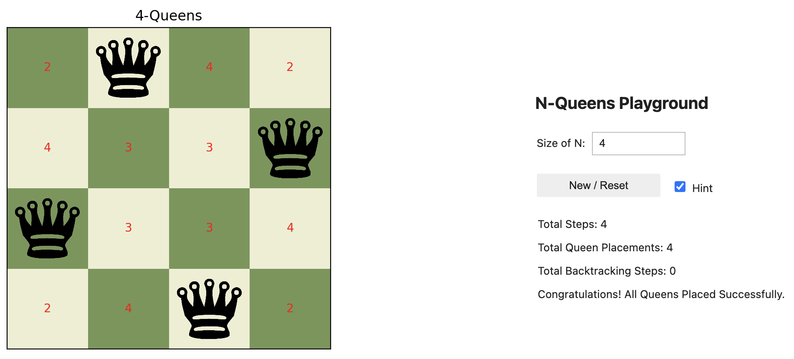
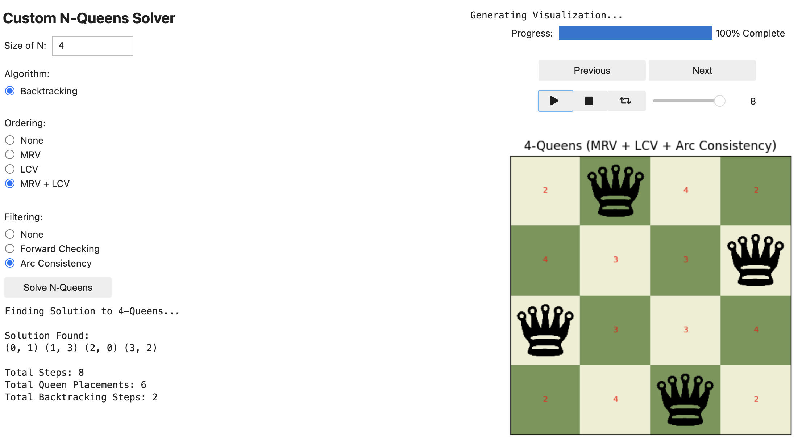

# ♕ Custom N-Queens Playground + Solver ♕
This repository showcases an intuitive visualization tool for understanding the various effects of Algorithms, Ordering Heuristics, and Filtering Techniques while solving N-Queens as a Constraint Satisfaction Problem (CSP).



## Overview 
The N-Queens problem involves placing N number of Queens on a size N x N chessboard in a way such that no two Queens can threaten each other. The approach is to formulate N-Queens as a CSP problem, where the objective is to find a solution of Queen placements on the board that satisfies all pre-defined constraints.

### CSP Formulation
- **Variables:** 
   - Rows on the board
- **Domain:**  
   - Columns for each row on the board
- **Constraints:**
   - No two Queens can share the same row. 
   - No two Queens can share the same column. 
   - No two Queens can share the same diagonal (both directions).
   - Exactly N Queens on the board when a solution is found.
     
### Solve Methods
For more details about each method, please refer to the comment section in the corresponding py file. 
- **Algorithms**
  - Backtracking Search  
- **Ordering Heuristics:**
  - Minimum Remaining Values / Most Constraining Variable (MRV/MCV)
  - Least Constraining Value (LCV)
- **Filtering Techniques:**
  - Forward Checking
  - Arc Consistency  
- **Combined Strategies**  
  - MRV + LCV
  - Ordering + Filtering

## Installation and Setup 
- Create and activate a virtual environment (to your liking):
- Install required libraries using pip:
    ```bash
    pip install -r requirements.txt
    ```
## How to Use 
Simply clone the repository and follow the `vis_tool.ipynb` Jupyter Notebook.
