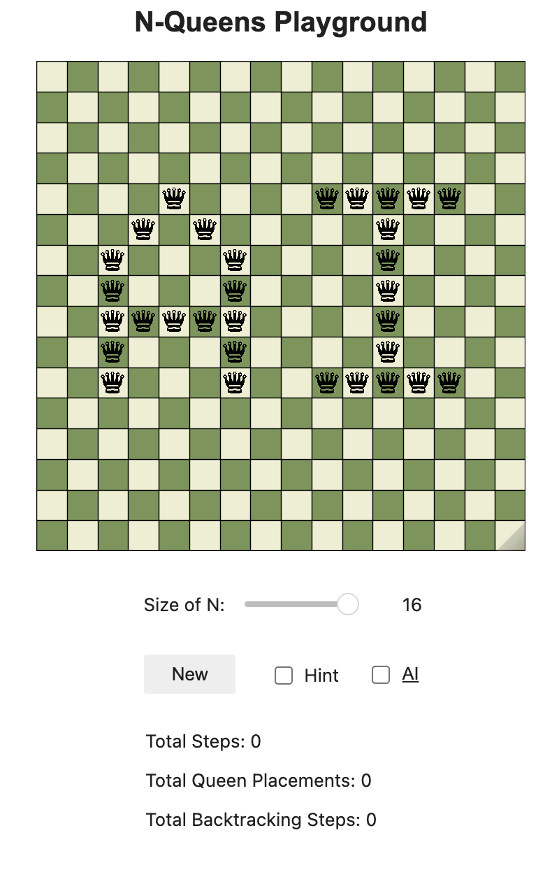

<h1 align="center">♕ N-Queens Playground + AI CSP Solver ♕</h1>
<p align="center">
  This repository showcases an intuitive visualization tool for understanding the various effects of algorithms, ordering heuristics, and filtering techniques in solving the N-Queens problem as a Constraint Satisfaction Problem (CSP).
</p>

<h3 align="center">Here is the preview:</h3>


<div align="center">
  
  
</div>

<div align="center">
  
</div>

<p align="center">
  <em>Explore the capabilities of AI and CSP algorithms through these comprehensive visualizations.</em>
</p>

## Quick Access

Access the N-Queens Playground hosted on Binder without the need to install anything locally:

**Click Here to Play**: [N-Queens Playground](https://mybinder.org/v2/gh/zijie-cai/N-Queens-Playground/HEAD?urlpath=%2Fvoila%2Frender%2Fn_queens_playground.ipynb)

## Overview 

The N-Queens problem tasks placing N Queens on an N x N chessboard so that no two Queens threaten each other. The solution approach uses CSP to find placements that satisfy all given constraints.

### CSP Formulation

- **Variables:** Rows on the board.
- **Domain:** Columns for each row.
- **Constraints:**
  - No Queens share the same row, column, or diagonal.
  - Exactly N Queens are on the board when a solution is found.

### Solve Methods

- **Algorithms:**
  - Backtracking Search.
- **Ordering Heuristics:**
  - Minimum Remaining Values (MRV).
  - Most Constraining Variable (MCV).
  - Least Constraining Value (LCV).
- **Filtering Techniques:**
  - Forward Checking.
  - Arc Consistency.
- **Combined Strategies:**
  - MRV + LCV.
  - Ordering + Filtering.

## Installation

Set up and use the N-Queens Playground locally by following these steps:

1. **Clone the repository:**
   ```bash
   git clone https://github.com/zijie-cai/N-Queens-Playground.git
