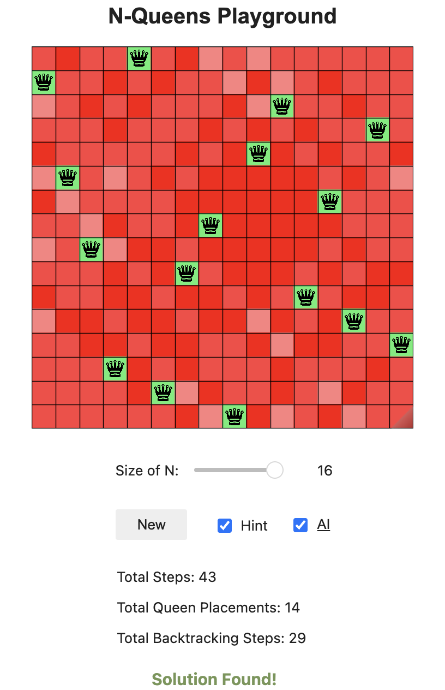

<h1 align="center">♕ N-Queens Playground + AI CSP Solver ♕</h1>

  This repository showcases an intuitive visualization tool for understanding the various effects of Algorithms, Ordering Heuristics, and Filtering Techniques while solving N-Queens as a Constraint Satisfaction Problem (CSP).

<h3 align="center">Here is the preview:</h3>

  
  

  
  

  <em>Explore the capabilities of AI and CSP algorithms through these comprehensive visualizations.</em>

## Quick Access
You can access the N-Queens Playground hosted on Binder without the need to install anything locally.

**Click Here to Play:** [N-Queens Playground](https://mybinder.org/v2/gh/zijie-cai/N-Queens-Playground/HEAD?urlpath=%2Fvoila%2Frender%2Fn_queens_playground.ipynb)

## Overview 
The N-Queens problem involves placing N number of Queens on an N x N chessboard in a way that no two Queens can threaten each other. This is formulated as a CSP problem, where the goal is to find placements for the Queens that satisfy all constraints.

### CSP Formulation
- **Variables:** Rows on the board.
- **Domain:** Columns for each row.
- **Constraints:**
   - No two Queens in the same row, column, or diagonal.
   - Exactly N Queens on the board when a solution is found.

### Solve Methods
This section introduces various strategies employed to tackle the N-Queens problem, enhancing both efficiency and effectiveness:
- **Algorithms:** Backtracking Search.
- **Ordering Heuristics:** Minimum Remaining Values / Most Constraining Variable (MRV/MCV), Least Constraining Value (LCV).
- **Filtering Techniques:** Forward Checking, Arc Consistency.
- **Combined Strategies:** Integration of MRV and LCV, Ordering with Filtering.

## Use Locally
Clone and set up the N-Queens Playground locally with these simple steps:
- **Clone the repository:**
  - `git clone https://github.com/zijie-cai/N-Queens-Playground.git`
- **Set up a virtual environment:**
  - Python virtual environments are recommended for managing dependencies.
- **Install dependencies:**
  - `pip install -r requirements.txt`

## Potential Improvements
- **Game Enhancements:** Introduce additional constraints to challenge users.
- **Solver Extensions:** Implement support for a broader range of solving algorithms.
